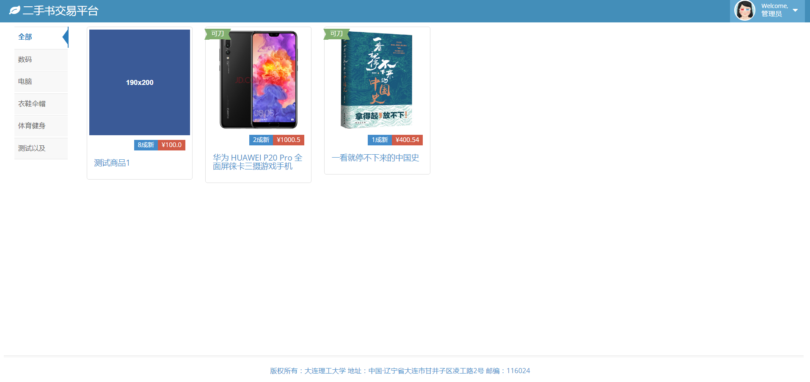
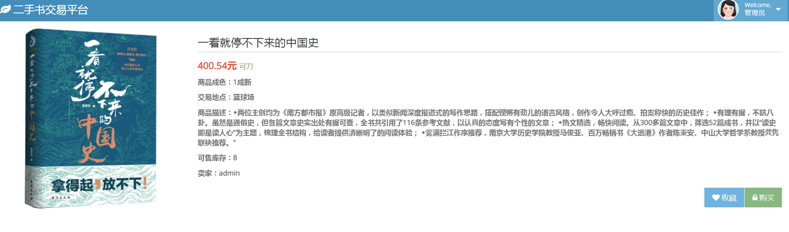
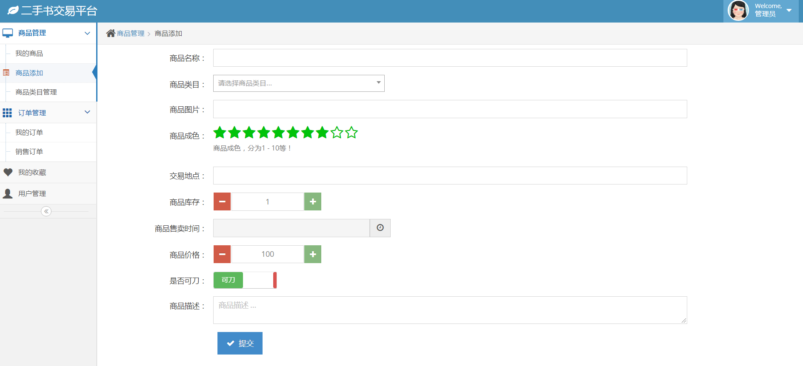

   <h3 align="center">校内二手交易</h3>
   

       使用spring mvc、spring、mybaties搭建的一个毕设小项目。可以将其当做开发
demo
   
 

#### 目录

[项目页面展示](https://github.com/yimiancheng/college-student-part-time-platform#项目页面展示)

[项目搭建](https://github.com/yimiancheng/college-student-part-time-platform#项目搭建)

[项目后台结构](https://github.com/yimiancheng/college-student-part-time-platform#项目后台结构)

#### 项目页面展示

> * 项目页面使用 [ace ](http://ace.jeka.by/index.html "ace") 前台框架，jsp开发前台页面，页面的公共部分（头部、左侧菜单栏、底部）通过jsp的 `jsp:include`引入
>
> * 前台页面中使用了大量的bootstrap组件，比如：bootstrap-dialog、bootstrap-table、bootstrap-switch、bootstrap-datetimepicker
> * 前台与后台交互使用ajax

* 首页

* 商详页

* 后台页面

   

#### 项目搭建

> 项目使用mysql数据库，创建Database=platform，导入sql文件 `./mysql/platform.sql`，数据库设计使用[EDZML工具](http://www.ezdml.com "EDZML官网")
>
> 使用maven管理项目
>
> 项目默认两个用户：chengshaohua1 / admin，密码都是1

#### 项目后台结构

> 项目采用mvc模式设计

##### 项目技术点

- [x] mybaties中对象使用enum类型 `com.dlut.platform.domain.SysOrderLog#orderStatus`
- [x] spring mvc 配置 string 转 date `com.dlut.platform.util.DateConverterMVC`

